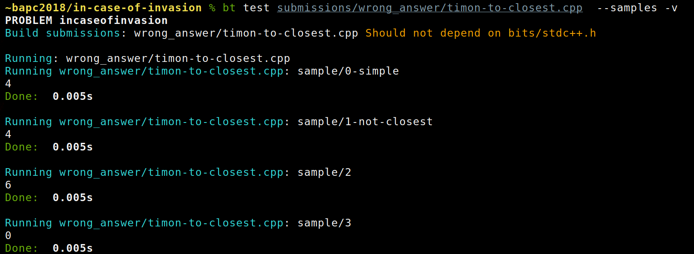

# BAPCtools

[](https://gitlab.com/ragnar.grootkoerkamp/BAPCtools/commits/master)

BAPCtools is a tool for creating and developing problems following the
CLICS (DOMjudge/Kattis) problem format specified [here](https://clics.ecs.baylor.edu/index.php?title=Problem_format).

The aim of this tool is to run all necessary compilation, validation, and
testing commands while working on an ICPC-style problem.
Ideally one should never have to manually run any compilation or testing command themselves.

I'm interested to know who's using this, so feel free to inform me (e.g. via an issue) if so ;)
The current state is relatively stable, but things do change from time to
time since I'm not aware of usage outside of BAPC yet.

## Installation

You can install the [bapctools-git AUR
package](https://aur.archlinux.org/packages/bapctools-git/), mirrored
[here](https://github.com/RagnarGrootKoerkamp/bapctools-git), or use the [Docker
image](#Docker).

Otherwise, clone this repository and install the required dependencies manually.
(If you know how to make a Debian package, feel free to help out.)

- Python 3 (>= 3.6).
- The [yaml library](https://pyyaml.org/wiki/PyYAMLDocumentation) via `pip install pyyaml` or the `python[3]-yaml` Arch Linux package.
- The [colorama library](https://pypi.org/project/colorama/) via `pip install colorama` or the `python[3]-colorama` Arch Linux package.
- The `argcomplete` library for command line argument completion. Install via
  `python[3]-argcomplete`.

  - Note that actually using `argcomplete` is optional, but recommended.
    Detailed instructions are [here](https://argcomplete.readthedocs.io/en/latest/).

    TL;DR: Put `eval "$(register-python-argcomplete[3] tools.py)"` in your `.bashrc` or `.zshrc`.

Optional dependencies, required for some subcommands:

- The [ruamel.yaml library](https://pypi.org/project/ruamel.yaml/) via `pip install ruamel.yaml` or the `python[3]-ruamel-yaml` Arch Linux package.
  - This is only needed for commands that update `generators.yaml`.
- The `latexmk` and `pdflatex` commands, provided by `texlive-bin` on Arch Linux and
  potentially some specific LaTeX packages (like tikz) provided by
  `texlive-extra`.
  These are only needed for building `pdf` files, not for `run` and `validate` and such.

After cloning the repository, symlink [bin/tools.py](bin/tools.py) to somewhere in your `$PATH`. E.g., if `~/bin/` is in your `$PATH`, you can do:

```
% ln -s ~/git/BAPCtools/bin/tools.py ~/bin/bt
```

### Windows

For Windows, you'll need the following in your
`path`:

- `Python` for Python 3
- `g++` to compile C++
- `javac` and `java` to compile and run `java`.

Resource limits (memory limit/hard cpu time limit) are also not supported.

BAPCtools makes use of symlinks for building programs. By default users are not allowed to create symlinks on Windows.
This can be fixed by enabling Developer Mode on Windows (Only works for Windows 10, version 1703 or newer).

(TODO: Copy instead of symlink files when symlinking is not allowed.)

### Docker

A docker image containing this git repo and dependencies, together with commonly
used languages, is provided at
[ragnargrootkoerkamp/bacptools](https://hub.docker.com/r/ragnargrootkoerkamp/bapctools).
This version may be somewhat outdated. Ping me if you'd like it to be updated.

This image can be used for e.g.:

- running CI on your repo. Also see `bt gitlabci` which generates a
  `.gitlab-ci.yaml` file. Make sure to clear the entrypoint, e.g. `entrypoint: [""]`.
- running `bt` on your local problems. Use this command to mount your local
  directory into the docker image and run a command on it:
  ```
  docker run -v $PWD:/data --rm -it ragnargrootkoerkamp/bapctools <bt subcommands>
  ```

## Usage

BAPCtools can be run either from a problem directory or a contest directory. This
is automatically detected by searching for the `problem.yaml` file.

The most common commands and options to use on an existing repository are:

- [`bt run [-v] [submissions [submissions ...]] [testcases [testcases ...]]`](#run)
- [`bt test <submission> [--interactive | --samples | [testcases [testcases ...]]]`](#test)
- [`bt generate [-v] [--jobs JOBS]`](#generate)
- [`bt validate [-v] [--remove | --move-to DIR] [testcases [testcases ...]]`](#validate)
- [`bt pdf [-v]`](#pdf)

The list of all available commands and options is at [doc/commands.md#synopsis](doc/commands.md#synopsis),
and more information regarding the implementation is at [doc/implementation_notes.md](doc/implementation_notes.md).

### Run

- `bt run [-v] [submissions [submissions ...]] [testcases [testcases ...]]`

Without arguments, the `run` command runs all submissions against all testcases.
Specify one or more submissions and one or more testcases to only run the given submissions against the given testcases.

Before running the given submissions, this command first makes sure that all generated testcases are up to date (in case `generators/generators.yaml` was found).


By default, `bt run` only prints one summary line per submission, and one additional line for each testcase with an unexpected result. Use `-v` to print one line per testcase instead.


### Test

- `bt test <submission> [--samples | [testcases [testcases ...]]]`

Use the `test` command to run a single submission on some testcases. The submission `stdout` and `stderr` are printed to the terminal instead of verified as an answer file.
Use `--samples` to run on the samples, or pass a list of testcases or directories containing testcases. Use `--interactive`/`-i` to run in interactive mode, where console input is forwarded to the submission.
This rebuilds and reruns the program until either `control-C` or `control-D` is pressed. It's also possible to supply the test case on the command line directly using e.g. `< /path/to/file.in` or `<<< "10 20"`.



### Generate

- `bt generate [-v] [--jobs JOBS]`

Use the `generate` command to generate the testcases specified in `generators/generators.yaml`. See [doc/generators.md](doc/generators.md) for the specification of `generators.yaml` and see [doc/commands.md#generate](doc/commands.md#generate) for the full list of arguents.
Use `-j 0` to disable running multiple jobs in parallel (the default is `4`).


### Validate

- `bt validate [-v] [--remove | --move-to DIR] [testcases [testcases ...]]`

Validate all the `.in` and `.ans` for all (given) testcases. It runs all validators from `input_validators` and `output_validators`.

Validators can be one of

- a single-file program.
- a multi-file program with all files in a common directory.
- a .ctd CheckTestData file (this needs the `checktestdata` executable in your `$PATH`).
- a .viva file.

You can use `--remove` to delete all failing testcases or `--move <dir>` to move
them to a separate directory.


### Pdf

- `bt pdf [-v]`

Use this command to compile the `problem.pdf` from the `problem_statement/problem.en.tex` LaTeX statement.
`problem.pdf` is written to the problem directory itself.

This can also be used to create the contest pdf by running it from the contest directory.

## Contributing / Style guide

- The python code in the repository is formatted using [black](https://github.com/psf/black).
  To enable the pre-commit hook, install [pre-commit](https://pre-commit.com/)
  with `pip` or your package manager (Arch: `python-pre-commit`) and run
  `pre-commit install` from the repository root. All python code will now automatically be formatted
  on each commit.

- Imports are usually ordered with system libraries first, followed by a
  newline, followed by local includes. Both groups are sorted alphabetically,
  and `import` comes before `from ... import`.
